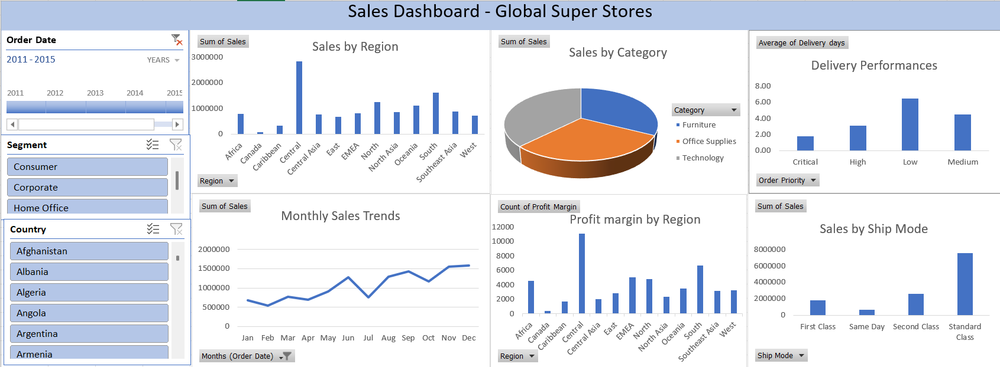

### 📊 Global Superstore — Excel Data Analysis

- **Tools:** Microsoft Excel, Power Query  
- **Description:**  
  End-to-end data cleaning, transformation, and business analysis of the Global Superstore dataset (51K+ rows).  
  The project includes data preparation using Power Query, pivot-based analysis, and dashboard-style visualizations to derive actionable business insights.

---

#### 🔧 Key Improvements
- Added **Profit & Profit Margin analysis** to evaluate business efficiency  
- Built **dashboard-style visualizations** for better storytelling  
- Structured insights using **Key Insight → Problem → Recommendation** framework  
- Improved data quality using **Power Query transformations and calculated columns**

---

#### 💡 Key Insights
- Central region contributes ~23% of total sales, indicating **high dependency on a single region**  
- Some regions (Africa, EMEA) are **loss-making despite generating revenue**  
- Overall profit margin is **~4.7%**, highlighting **cost and pricing inefficiencies**  
- Strong **seasonal trend**, with peak sales in Q4  
- Customers heavily prefer **Standard shipping (61%)**, indicating price sensitivity  

---

#### 🔗 Project Link  
👉 [View Full Project](YOUR_GITHUB_LINK_HERE)
