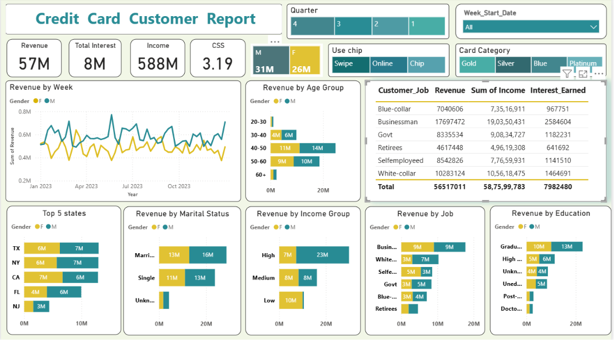
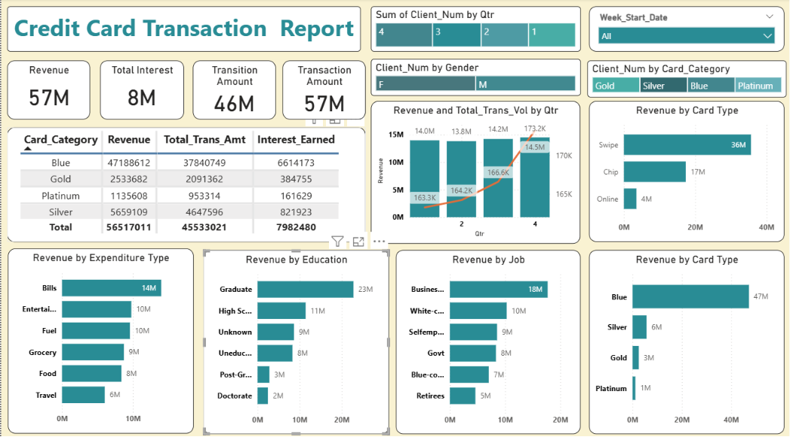
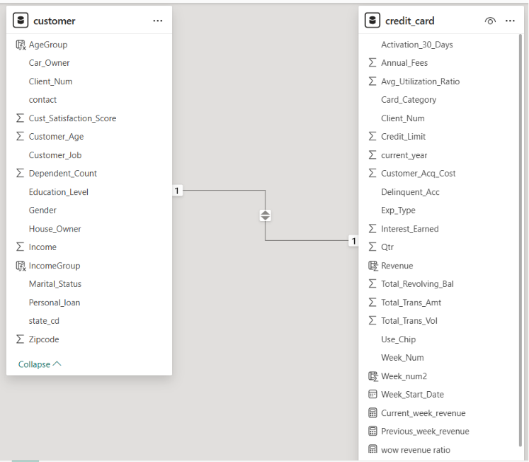
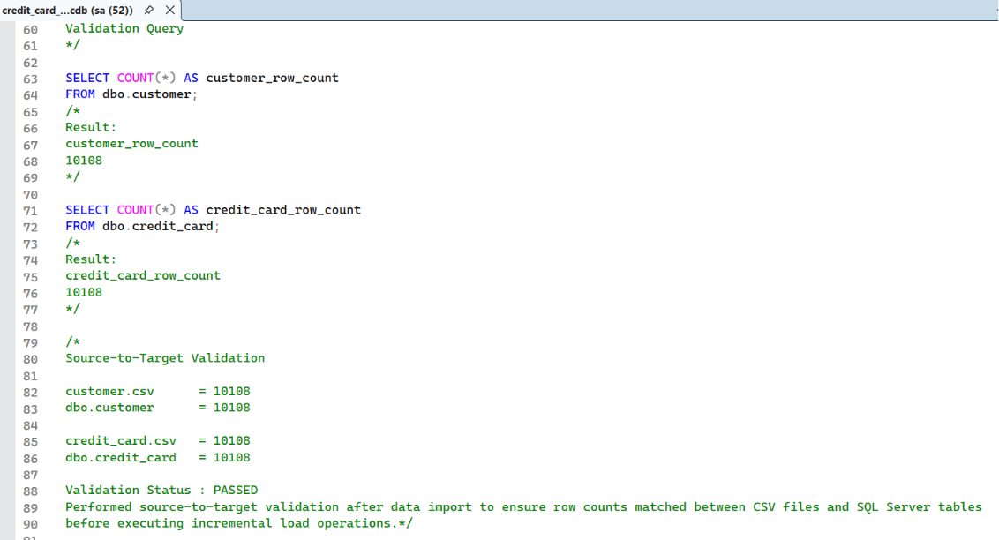
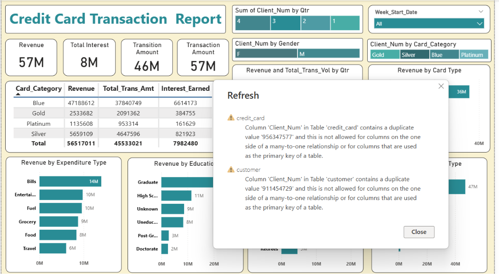

# Credit Card Financial Dashboard using Power BI

## Project Overview

### Project Name

**Credit Card Customer & Transaction Analysis**

## Project Overview

### Summary

This project analyzes customer spending behavior and credit card transaction patterns using SQL Server and Power BI. It includes data validation, incremental loading, DAX calculations, and interactive dashboards for customer and transaction analysis.

## Business Objective

To develop an interactive Credit Card Financial Dashboard that helps stakeholders monitor revenue, customer activity, transaction performance, and business trends.

---

## Dataset Information

### Source

The dataset is sourced from a public YouTube Power BI project and is used for learning and portfolio purposes.

### Tables

#### Customer Table

| Dataset Stage | Rows | Columns |
|--------------|------|---------|
| Initial Load (customer.csv) | 10,108 | 15 |
| Incremental Load (cust_add.csv) | 185 | 15 |
| Final Dataset | 10,293 | 15 |

#### Credit Card Transaction Table

| Dataset Stage | Rows | Columns |
|--------------|------|---------|
| Initial Load (credit_card.csv) | 10,108 | 18 |
| Incremental Load (cc_add.csv) | 185 | 18 |
| Final Dataset | 10,293 | 18 |

### Incremental Loading Scenario

This project simulates a real-world business scenario where new weekly transaction data is periodically received and appended to existing datasets.

- Initial data load: 10,108 records
- Week-53 incremental load: 185 records
- Final dataset after append: 10,293 records

Source-to-target validation was performed before and after the incremental load process to ensure data accuracy.

### Relationship

`Client_Num`

---

## Data Architecture & Workflow

1. Created database and tables in SQL Server.
2. Imported CSV files using SQL Server Import Wizard.
3. Performed source-to-target validation.
4. Loaded incremental Week-53 data.
5. Built Power BI data model.
6. Created DAX calculations.
7. Developed dashboards.
8. Investigated data quality issues.
9. Rebuilt and validated the final dataset.

---

## DAX Calculations

The dashboard uses calculated columns and measures to support customer segmentation, revenue calculation, and Week-over-Week (WoW) analysis.

### Calculated Columns

| Column | Purpose |
|----------|----------|
| AgeGroup | Categorizes customers into age bands |
| IncomeGroup | Categorizes customers based on income |
| Revenue | Calculates revenue from Annual Fees, Transaction Amount, and Interest Earned |
| Week_num2 | Extracts week number from transaction date |

### Measures

| Measure | Purpose |
|----------|----------|
| Current_week_revenue | Revenue for the latest available week |
| Previous_week_revenue | Revenue for the previous week |
| wow_revenue_ratio | Week-over-Week revenue growth percentage |

### Calculated Columns

#### AgeGroup

```DAX
AgeGroup =
SWITCH(
    TRUE(),
    customer[Customer_Age] < 30, "20-30",
    customer[Customer_Age] >= 30 && customer[Customer_Age] < 40, "30-40",
    customer[Customer_Age] >= 40 && customer[Customer_Age] < 50, "40-50",
    customer[Customer_Age] >= 50 && customer[Customer_Age] < 60, "50-60",
    customer[Customer_Age] >= 60, "60+",
    "Unknown"
)
```

#### IncomeGroup

```DAX
IncomeGroup =
SWITCH(
    TRUE(),
    customer[Income] < 35000, "Low",
    customer[Income] >= 35000 && customer[Income] < 70000, "Medium",
    customer[Income] >= 70000, "High",
    "Unknown"
)
```

#### Revenue

```DAX
Revenue =
credit_card[Annual_Fees] +
credit_card[Total_Trans_Amt] +
credit_card[Interest_Earned]
```

#### Week_num2

```DAX
Week_num2 =
WEEKNUM(credit_card[Week_Start_Date])
```

### Measures

#### Current Week Revenue

```DAX
Current_week_revenue =
CALCULATE(
    SUM(credit_card[Revenue]),
    FILTER(
        ALL(credit_card),
        credit_card[Week_num2] =
        MAX(credit_card[Week_num2])
    )
)
```

#### Previous Week Revenue

```DAX
Previous_week_revenue =
CALCULATE(
    SUM(credit_card[Revenue]),
    FILTER(
        ALL(credit_card),
        credit_card[Week_num2] =
        MAX(credit_card[Week_num2]) - 1
    )
)
```

#### WoW Revenue Ratio

```DAX
wow_revenue_ratio =
DIVIDE(
    credit_card[Current_week_revenue] -
    credit_card[Previous_week_revenue],
    credit_card[Previous_week_revenue]
)
```

### KPI Validation

A separate KPI Validation page was created to verify:

- Current Week Revenue
- Previous Week Revenue
- WoW Revenue Ratio
- Delinquency Rate
- Activation Rate

before publishing the final dashboards.

---

## Dashboard Screenshots

### Customer Analysis Dashboard

This dashboard provides customer-centric insights by analyzing revenue contribution, customer satisfaction score (CSS), age groups, income groups, marital status, education levels, and state-wise performance. It helps identify key customer segments contributing to overall business revenue.



### Transaction Analysis Dashboard

This dashboard focuses on credit card transaction performance, including revenue trends, transaction amounts, interest earned, card category analysis, expenditure patterns, and Week-over-Week (WoW) revenue growth. It enables stakeholders to monitor business performance and transaction behavior effectively.



### Data Model

The Power BI model consists of customer and credit_card tables connected through Client_Num.



### Source-to-Target Validation

Validation performed after importing raw source files into SQL Server.



### Duplicate Relationship Error

While validating the incremental data load process, Power BI generated relationship refresh errors due to duplicate `Client_Num` values in the SQL Server tables.

Investigation revealed that Week-53 data had been loaded multiple times, resulting in duplicate customer and transaction records. The issue was resolved by rebuilding the tables from the original source files, validating row counts, and performing a clean append process.



---

## Key Insights

### Week-53 Analysis

#### Week-over-Week Performance

- Revenue increased by **28.8%**
- Transaction Amount increased by **35.04%**
- Customer count increased from **124 to 185**
- Customer growth increased by **49.19%**

#### Year-to-Date Overview

- Total Revenue: **57M**
- Total Interest Earned: **8M**
- Total Transaction Amount: **46M**
- Male Customers Revenue: **31M**
- Female Customers Revenue: **26M**

#### Additional Findings

- Blue and Silver cards contributed approximately **93%** of total transactions.
- Swipe transactions generated the highest revenue contribution among all transaction modes.
- Businessmen, white-collar professionals, and self-employed customers contributed a significant share of overall revenue.
- TX, NY, and CA contributed approximately **68%** of overall transactions.
- Overall Activation Rate: **57.5%**
- Overall Delinquent Rate: **6.06%**

---

## Challenges & Troubleshooting

### Datatype Overflow Issue

While loading transaction data into SQL Server, a datatype overflow issue was encountered.

#### Root Cause

The column:

`Total_Trans_Amt`

was defined as **SMALLINT**.

However, transaction values reached:

`79,463`

which exceeded the SMALLINT maximum value of:

`32,767`

#### Resolution

- Investigated schema using INFORMATION_SCHEMA.COLUMNS.
- Validated maximum transaction value using SQL queries.
- Identified the problematic record.
- Altered datatype from SMALLINT to INT.
- Successfully completed the data load.

**Reference File:**  
`sql/credit_card_smallint_overflow_analysis.sql`

---

### Duplicate Records Investigation

During project maintenance and validation, duplicate records were identified after repeated incremental load operations.

#### Symptoms

- Unexpected row counts.
- Duplicate customer records.
- Duplicate transaction records.
- Power BI relationship refresh failures.

#### Investigation Activities

- Source-to-target validation.
- Row count reconciliation.
- Duplicate record analysis.
- Incremental load verification.
- Power BI refresh troubleshooting.

#### Power BI Relationship Error


#### Resolution

- Rebuilt database tables.
- Re-imported raw source files.
- Performed row count validation.
- Executed a clean incremental load.
- Verified final row counts.
- Successfully refreshed Power BI dashboards.

**Reference File:**  
`sql/credit_card_data_rebuild.sql`

#### Key Learnings

- Importance of source-to-target validation before reporting and analysis.
- Importance of row count reconciliation during data loading and incremental updates.
- Understanding how duplicate records can impact Power BI relationships and dashboard accuracy.
- Managing incremental data loads carefully to avoid duplicate data insertion.
- Importance of selecting appropriate datatypes during database design.
- Understanding the role of Primary Keys and unique identifiers in maintaining data integrity.
- Learned that while this practice project did not enforce Primary Key constraints, production systems should use Primary Keys or unique constraints to prevent  duplicate records during incremental loads.
- Understanding how data quality issues in upstream systems can directly impact downstream reporting and business intelligence solutions.

---

## SQL Scripts Included

### credit_card_schema_setup.sql

Contains database and table creation scripts used for initial project setup.

### credit_card_smallint_overflow_analysis.sql

Documents investigation and resolution of the SMALLINT datatype overflow issue encountered during data loading.

### credit_card_data_rebuild.sql

Documents source-to-target validation, duplicate record investigation, data recovery, and final incremental load process.

---

## Repository Structure

```text
Credit_Card_Financial_Analysis
│
├── README.md
│
├── sql
│   ├── credit_card_schema_setup.sql
│   ├── credit_card_smallint_overflow_analysis.sql
│   └── credit_card_data_rebuild.sql
│
├── screenshots
│   ├── source_to_target_validation.png
│   ├── data_model.png
│   ├── customer_dashboard.png
│   ├── transaction_dashboard.png
│   └── duplicate_error.png
│
└── powerbi
    └── Credit_Card_Financial_Dashboard.pbix
```

---

## Tools & Technologies

- SQL Server
- SQL Server Management Studio (SSMS)
- Power BI Desktop
- Power Query
- DAX
- Excel

---

## Future Improvements

- Predictive analytics for customer churn.
- Fraud detection analysis.
- Advanced customer segmentation.
- Automated incremental data loading.
- Power BI Service deployment.

---

## Author

**Asma Shaik**

Data Analyst | SQL | Power BI | Python

GitHub: https://github.com/Asmashaik7
